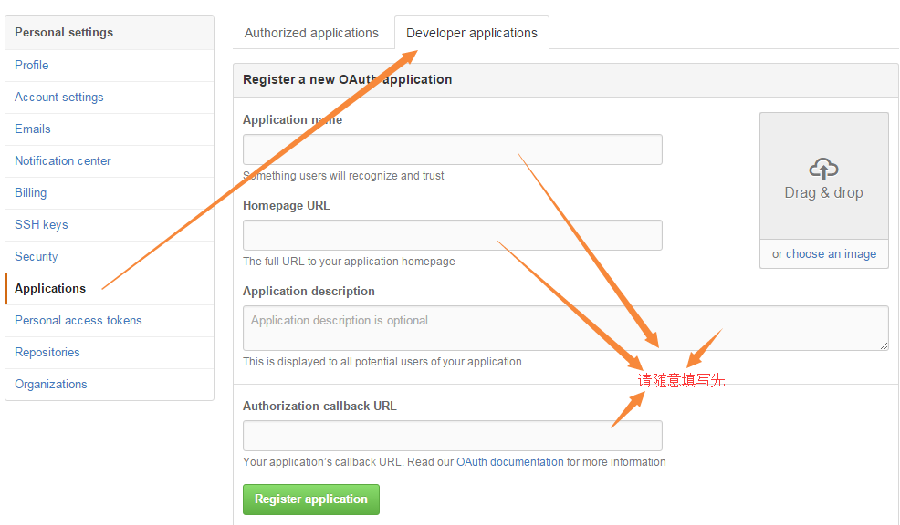

#以开源项目PocketHub为入口，了解android开发环境

##几个知识点的了解
1. OAuth2.0:
   
    1.1 [请移驾阮老师博客](http://www.ruanyifeng.com/blog/2014/05/oauth_2_0.html)

    1.2 即使有疑惑依旧能解决，请按部就班操作：
        
    1.3 通过上面步骤拿到两个属性：client & secret留用。
   
2. **Google Guice** & **RoboGuice**,请移步[Guice](http://www.tuicool.com/articles/yqueqa),[RoboGuice](http://www.cnblogs.com/avenwu/archive/2013/05/30/3109455.html)
3. 

##环境搭建：win7+android studio1.5+jdk1.8.60+红米1
    - project
        1. 新增gradle.properties文件，内容如下：pockethub_github_client=***；pockethub_github_secret=***；pockethub_github_callback=http://localhost/pockethub/callback,星号部分是1.3中拿到的两个属性值    
        + app
            -build.gradle 
                2. 注释掉一行脚本：def gitSha='git rev-parse --short HEAD'.execute([],project.rootDir).text().trim() 
                3. 修改依赖项版本：com.android.tools.build:gradle:1.5.0(默认是1.3.0)这个无所谓，仅仅是码人的强制心理导致
    
