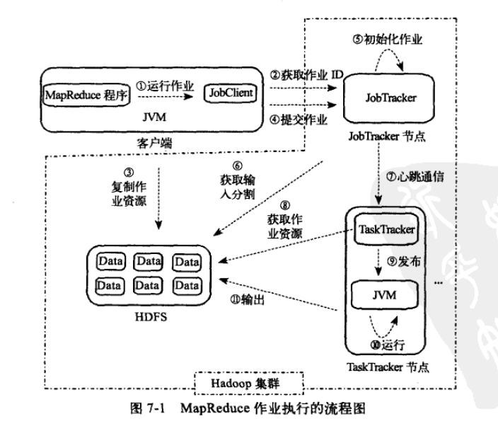
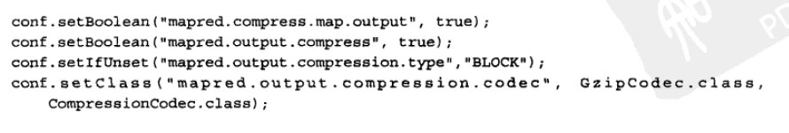
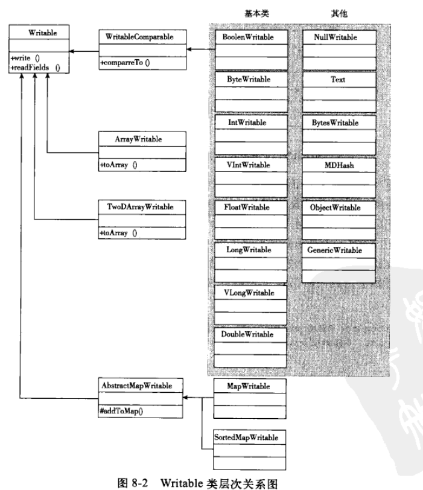

# MapReduce工作机制

##作业执行流程

- Map & Reduce:前者的输出对应后者的输入
- 输入输出路径配置：必须保证输出路径存在
- 提交作业、初始化作业、执行任务、更新任务执行状态及进度
- taskTracker & JobTracker通过心跳机制完成状态回报和任务分配

##错误处理机制
- 失败四次时则终止整个作业；
- 长时间运行或死循环会被杀死；

##作业调度机制
- FIFO调度法则
- Fair scheduler guide
- capacity scheduler guide
##shuffle和排序
- shuffle是对map的结果进行partition、sort & split,将同一划分的输出结果合并在一起，写在磁盘上，发给对应的reduce

##任务执行
- 推测式执行：mapred.map.tasks.speculative.execution mapred.reduce.tasks.speculative.execution
- 任务JVM重用：mapred.job.reuse.jvm.num.tasks 默认1，-1表示无限制
- 跳过坏记录：默认关闭
- 任务执行环境：

#I/O操作
- I/O相关的包：
    - org.apache.hadoop.io
    - org.apache.hadoop.io.compress
    - org.apache.hadoop.io.file.tfile
    - org.apache.hadoop.io.serializer
    - org.apache.hadoop.io.serializer.avro
- 与通用IO不同的地方包括
    - GB VS PB
    - 单个存储和分布式block存储
    - 不仅考虑单机IO，还要考虑网络传输效率
- 数据检查：
    - 本地文件系统完整性：fs.file.impl-org.apache.hadoop.fs.LocalFileSystem(RawLocalFileSystem),存储和读取文件时进行校验
    - HDFS系统数据完整性：DataNode接收数据且保存数据前；客户端读取DataNode数据前；DataNode后台检测进程
    - hadoop fs -copyToLocal -ignoreCrc input ~/Desktop

- 压缩算法
    - DEFLATE Gzip bzip2 LZO
    
    - 压缩分割和输入分割：bzip2支持分割
    
- 数据I/O序列化操作
    - 目的：进程间通信&持久化存储
    - RPC通信：紧凑&快速&可扩展&互操作性
    - writable类关系图
    
    - Text类与String区别
    - 针对MapReduce的文件类
        - MapFile是经过排序并带有索引的SequenceFile
        - hadoop fs -text mySequenceFile
        - 未压缩和只压缩value的sequencesFile

