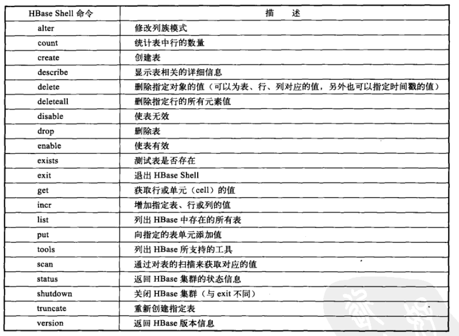

# HIVE详解

##hive简介
- ETL工具、数据存储管理、大型数据集查询和分析
- 支持HQL
- 支持MapReduce
- 缺点：不提供排序+cache功能；不提供在线事务处理；不提供实时查询和记录级更新
- 使用场景：大规模不变数据集的批量任务，扩展性、延展性、容错性及低约束性输入格式
- hive.metastore.warehouse.dir
1. 数据存储：无专门数据存储格式，告知列分隔符和行分隔符即可
2. 数据模型：
	- table: 类似于RMDB，数据存储到数据仓库的数据目录。

	- external table: 创建表语句与加载数据同时完成，但数据存储在HDFS中目录（location指定），不会移动到数据仓库的数据目录；删除表时，数据不会删除

	- partition: 对应数据库中相应分区列的一个索引，对应表下的一个目录

	- bucket: 对指定列进行hash运算，根据hash值切分数据，每个桶对应一个文件；

3. 元数据的CRUD不断变化，不适合存储在HDFS中，适合放在RDBMS中：derby||mysql||thrift
##基本操作
1. 配置：
	- hive.metastore.warehouse.dir
	- hive.exec.scratchdir 临时文件目录
	- db
	- $HIVE_CONF_DIR下hive-site.xml优先级大于hive-default.xml；会读取且覆盖$HADOOP_CONF_DIR下的配置文件
	- set mapred.job.tracker=myhost.mycompany.com:80030
	- set mapred.reduce.tasks=100
	- set -v
	- set mapred.job.tracker=local
	- set hive.exec.model.local.auto=false
	- hive.exec.mode.local.auto.inputbytes.max默认128M，hive.exec.model.local.auto.tasks.max默认4，reduce为1或0时，则默认在本地模式执行
	- hive/bin -hiveconf hive.root.logger=INFO,console

##HQL操作:DML DDL
- like修饰的create table允许复制一个已存在表的定义
- stored as textfile
- serde
- 表和分区都可以对某个列进行clustered by 操作，将若干个列放入bucket中；也可以用sort by 存储数据，提高查询性能
- 表名和列名不区分大小写，serde和属性名区分大小写	
- 创建、删除、修改表及分区
- 创建和删除视图
- 创建和删除函数
- TODO

##WebUI接口

##JDBC接口

##优化

#HBase详解
- 大型数据随机和实时的读写访问
- 硬件要求低，结合HDFS实现很高的健壮性
- 分布式、多版本、面向列的存储模型

##基本操作
- $HBase/lib目录下有对应稳定版的hadoop*.jar
- 单机模式：默认安装方式
- 伪分布式模式：
	- 所有守护进程运行在同一个节点;
	- dfs.replication=1(指定Hlog和Hfile的个数);
	- hbase.rootDir需要hadoop自己创建；
- 分布式模式：
	- 设置hbase-site.xml
	- 设置hbase-env.sh来配置全局Hbase集群特性
	- ZooKeeper维护各hbase实例间的通信
	- hbase-rootdir 区域服务器存储数据目录
	- hbase.cluster.distributed指定分布式、单击或伪分布式模式
	- 每台域服务器的hosts文件必须相同，且配置conf/regionservers
	- conf/hbase-env.sh中的HBASE_MANAGES_ZK为true时使用默认实例，false时则独立配置zookeeper，hbase.zookeeper.quorum=Hbase-1,Hbase-2,Hbase-3
	- zookeeper独立模式时需要先启动zookeeper，然后启动hbase；hadoop集群的namenode即为hbase集群的hmaster
	- hbase shell
	
		- create 'test','c1','c2'
		- list
		- put 'test','r1','c1:1','value1-1/1'
		- put 'test','r1','c1:2','value1-1/2'
		- put 'test','r2','c1:1','value2-1/1'
		- put 'test','r2','c2:1','value2-2/1'
		- scan 'test'
		- get 'test','r1',{COLUMN=>'c2:1'}
	- Hbase配置:
		- hbase.client.write.buffer 缓冲区，默认2M
		- hbase.master.meta.thread.rescanfrequency 毫秒，默认60 000
		- hbase.regionserver.handler.count 能处理的最大客户端连接数，服务器端写数据消耗的内存为hbase.regionserver.handler.count*hbase.client.write.buffer
		- hbase.hregion.max.filesize hstorefile文件的最大值，字节为单位，当表中的列族超过此值时将被分割，默认256M
		- hfile.block.cache.size Hfile占jvm的百分比，默认0.2，即20%，设置为0则表示禁用
		- hbase.regionserver.global.memstore.upperLimit Region服务器中memstore所在jvm的最大值，默认0.4，及40%，当超过此值时，更新操作被阻塞，所有的内容被强制写出
		- hbase.hregion.memstore.flush.size 默认64M，当memstore缓存内容的大小超过此值，将被写到磁盘上

##体系结构
- 

##数据模型

##与RMDBS

##HDFS

##客户端

##JAVA API

##编程实例之MapReduce

##模式设计

