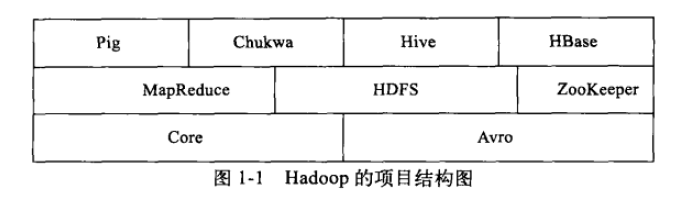

# hadoop简介

## 优势
- 高可靠性：按位存储&大数据
- 高扩展性：集群式部署
- 高效性：动态平衡数据&速度快
- 高容错性：3副本原则

## 项目结构图

- core:common 文件系统 & RPC & 串行化接口
- avro TODO
- MapReduce 针对大数据集处理（>1TB）
- HDFS 目标如下：
	1. 检测和恢复硬件故障
	2. 流式数据访问：重视吞吐量而不是反应速度
	3. 简化一致性模型：一次写入，多次读取->高一致性+高吞吐量
	4. 通信协议:客户端协议和数据节点协议

- chukwa 数据收集系统，监控和分析大数据
- hive 数据仓库
- hbase 分布式、面向列的DB；非结构化数据存储；随机访问、实时读写大数据；
- pig 对大数据集进行分析和评估

## 分布式几个核心概念

- 数据分布式存储:HDFS将文件切割为block，存储于不同的datanode，且冗余存储；名字节点存储文件被分为多少个block，存储在哪里及各节点的状况信息；
- 分布式计算：jobtracker对应任意节点；tasktraker同时是计算和存储节点
- 本地计算：移动计算比移动数据更经济
- 任务粒度：分割任务为<=Block，便于本地计算
- 任务分割：
- 数据合并：combine，在map段进行，减少网络流量
- Reduce：map的产物是一个文件落地，然后通知reduce任务到多个map机上获取并合并
- 任务管道：多个reduce不需要合并，作为另一个标准输入，从而形成管道

## hadoop计算模型：MapReduce
## hadoop数据管理：HDFS & HBase & Hive
###HDFS
特质：
	- 针对集群由单一的命名空间
	- 数据一致性：适合一次写入多次读取
	- block文件块
	特有
	- 三备份：指定datanode + 同rack上 + 其他datanode
	- 心跳检测
	- 数据复制：threshold
	- 数据校验：crc32校验
	- 单个namenode
	- 数据管道
	- 安全模式
###Hbase数据管理
- 类似于bigtable，多维度排序映射表；
- 表的索引是行关键字、列关键字和时间戳；
- 数据都是字符串，无类型
- 每一行都有一个可排序的主键和任意多的列-*稀疏存储*
- 多版本保存
- HBaseMaster LEA选举产生 根||根域目录、源域目录 
  1. 负责域分配：根域->元域
  2. 监视域服务器的运行情况
  3. 表格管理，列簇删除
  4. 当主服务器不可用时，整个集群都需要重启

- 元表：用户域的所有信息，起始关键字、结束关键字、域是否在线、域所在域服务器的地址
- 根表：存储单一域的信息，并指向元表的所有域，元域信息及元域所在域服务器的地址
- 根表和元表中每行大约1k，域默认大小256M，根域可以映射26w个元域，元域映射256个用户域
- HRegionServer 服务于主服务器的域，处理客户端读写请求、缓冲区回写、压缩和分割域
  1. 每个域只能有一台域服务器来服务，从当前HDFS系统中读取日志及存储文件
  2. 预写日志文件Hlog->存储缓冲区->磁盘落地->缓存区回写（HStore）
  3. HStore映射文件默认256M，
- HClient 查找用户域所在的域服务器地址
###Hive数据管理
- 元数据存储:元数据存储在RDBMS中，分为singleUserModel、MultiUserModel和RemoteServerModel
- 数据存储：行列分隔符、数据模型（Table,External Table,Partition,Bucket）
- 数据交换：TODO
