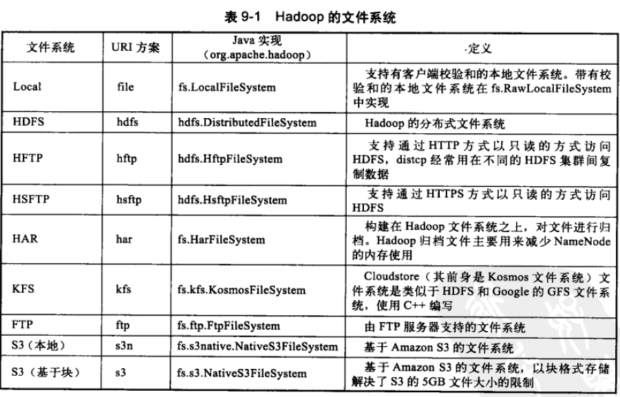

# HDFS详解 TODO

##hadoop 文件系统

- thrift协议：支持序列化和多种类型的RPC
##HDFS简介
- 处理超大文件：数百MB，TB文件大小
- 流式访问数据：一次写入，多次读取
- 廉价机上运行
- 不适合低延迟
- 无法高效存储大量小文件
- 不支持多用户同时写入及任意修改文件
##相关概念
- 块 ：默认64M，一般设置为256M，hadoop fsck / -files -blocks
##命令行操作
- hadoop fs -lrs ls
- hadoop fs mkdir tmpDir
##java API
- hadoop url类读取：FsUrlStreamHandlerFactory
- hadoop FileSystem读取:

#Hadoop 管理
- NameNode的文件结构：
    - ${dfs.name.dir}/current
        - /VERSION
        - /edits
        - /fsimage
        - /fstime
    - namespaceID+cTime+storageType+layoutVersion
    - 

TODO

