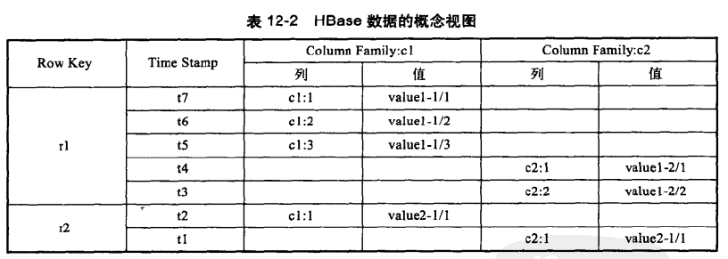
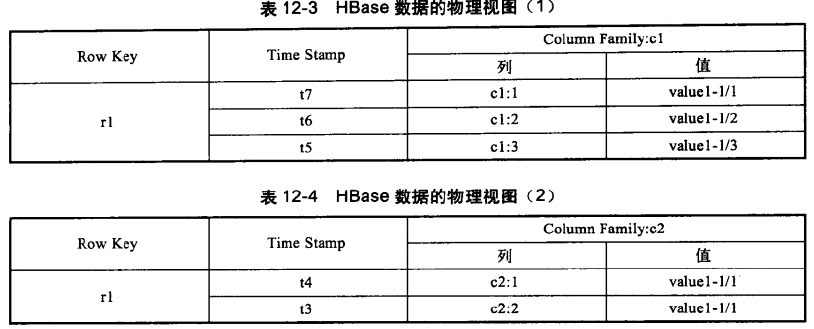

#HBase详解
- 大型数据随机和实时的读写访问
- 硬件要求低，结合HDFS实现很高的健壮性(亦可使用本地文件系统)
- 分布式、多版本、面向列的存储模型
- 动态添加数据列

##基本操作
- $HBase/lib目录下有对应稳定版的hadoop*.jar
- 单机模式：默认安装方式
- 伪分布式模式：
	- 所有守护进程运行在同一个节点;
	- dfs.replication=1(指定Hlog和Hfile的个数);
	- hbase.rootDir需要hadoop自己创建；
- 分布式模式：
	- 设置hbase-site.xml
	- 设置hbase-env.sh来配置全局Hbase集群特性
	- ZooKeeper维护各hbase实例间的通信
	- hbase-rootdir 区域服务器存储数据目录
	- hbase.cluster.distributed指定分布式、单击或伪分布式模式
	- 每台域服务器的hosts文件必须相同，且配置conf/regionservers
	- conf/hbase-env.sh中的HBASE_MANAGES_ZK为true时使用默认实例，false时则独立配置zookeeper，hbase.zookeeper.quorum=Hbase-1,Hbase-2,Hbase-3
	- zookeeper独立模式时需要先启动zookeeper，然后启动hbase；hadoop集群的namenode即为hbase集群的hmaster
	- hbase shell
	
		- create 'test','c1','c2'
		- list
		- put 'test','r1','c1:1','value1-1/1'
		- put 'test','r1','c1:2','value1-1/2'
		- put 'test','r2','c1:1','value2-1/1'
		- put 'test','r2','c2:1','value2-2/1'
		- scan 'test'
		- get 'test','r1',{COLUMN=>'c2:1'}
	- Hbase配置:
		- hbase.client.write.buffer 缓冲区，默认2M
		- hbase.master.meta.thread.rescanfrequency 毫秒，默认60 000
		- hbase.regionserver.handler.count 能处理的最大客户端连接数，服务器端写数据消耗的内存为hbase.regionserver.handler.count*hbase.client.write.buffer
		- hbase.hregion.max.filesize hstorefile文件的最大值，字节为单位，当表中的列族超过此值时将被分割，默认256M
		- hfile.block.cache.size Hfile占jvm的百分比，默认0.2，即20%，设置为0则表示禁用
		- hbase.regionserver.global.memstore.upperLimit Region服务器中memstore所在jvm的最大值，默认0.4，及40%，当超过此值时，更新操作被阻塞，所有的内容被强制写出
		- hbase.hregion.memstore.flush.size 默认64M，当memstore缓存内容的大小超过此值，将被写到磁盘上

##体系结构
- 逻辑表会被分割为多个HRegion，存储到一个或多个节点；HMaster只存储数据到HRegion的映射关系
- HRegion：保存表中连续的某段数据，从开始主键到结束主键
- HMemorycache: 先读取缓存，假如没有再从Hstores磁盘上读取HstoreFile文件
- Hlog:磁盘上的记录文件，记录所有更新操作，每次操作在写入Hlog后才会commit，最后返回客户端。会定期回滚，占用时间少，且按照时间备份文件，减少文件尺寸
- 每个列簇都是一个Hstore集合，包含多个HstoreFile文件
- HResion.flushcache()会将HMemorycache内容写到文件中，并新增一个HStoreFile文件，并清空缓存，追加到Hlog中。
- 启动顺序：检查Hlog，最近一次flushcache是否已经写入，没有则更新，删除旧的Hlog，然后供用户访问
- 尽量少调用flushcache操作，会增加内容使用量，且重启会占用较长时间；频繁调用则会造成负载瞬间增加
- Hstore.compact():flushcache会新增Hstorefile文件，而compact会定期合并这些文件，但在hstorefile超过一定设置值时才会触发
- Hregion.closeAndMerge()：将两个Hregion合并为一个，但需要停机操作
- Hregoin.closeAndSplit():当hregion巨大时，会触发分隔操作
- 运行多个HMaster，且通过ZooKeeper保证只有一个Master在运行，自动实现SPFO

##数据模型
- 都是字符串，数据类型
- 表的索引是关键字、列关键字和时间戳
- 列格式<family>:<qualifier>
- 同一列簇存储在同一目录，是锁行的
###概念视图

###物理视图

##与RMDBS
- 数据类型
- 数据操作：简单的CRUD，不存在表之间的关联union & join
- 存储模式：基于列 VS 基于表格结构和行模式
- 数据维护：HBase是插入，不是更新
- 可伸缩性：集群式扩展
##HDFS
需要修改hbase.rootdir目录指向HDFS路径

##客户端

##JAVA API

##编程实例之MapReduce

##模式设计